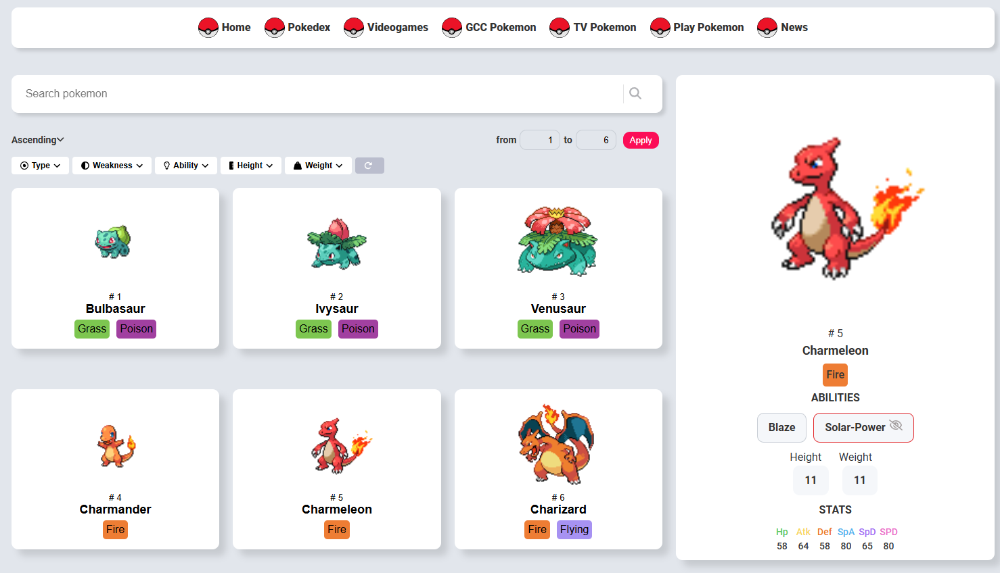

# Pokemon UI

## Pokemon API

This project, i use API `pokeapi.co/api/v2/pokemon/{pokemon-id}` for sample data.
Read more: [Pokemon API](https://pokeapi.co/docs/v2).

## Interface image



## Run Project with docker

```bash
docker build .
```

Then, change images in docker-compose.yml to images built
Example:

```yml
image: 3618bba09014
```

Run docker compose, project run with port 3000

```bash
docker-compose up -d
```
